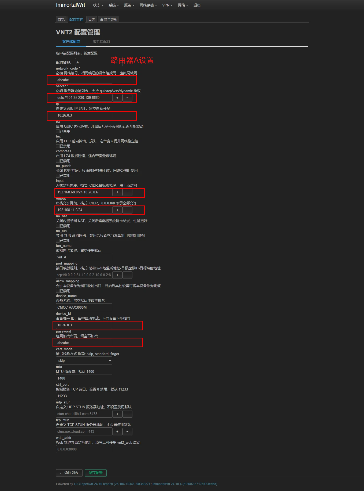
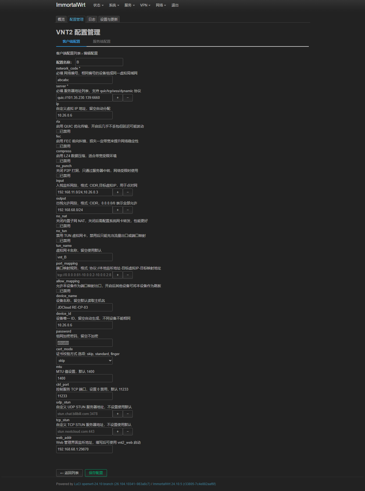
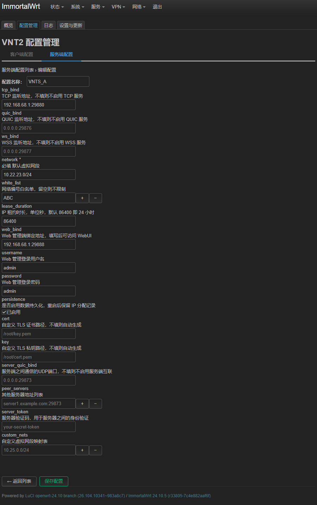
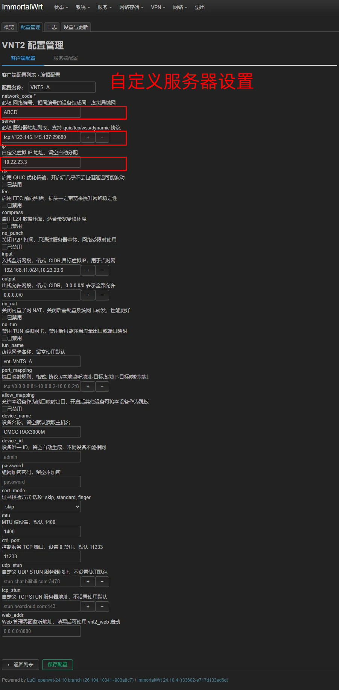

# VNT 2.0 组网教程

## 一、安装 luci-app-vnt2

### 快速安装（终端执行）

```bash
curl -fsSL "https://gitlab.com/whzhni/tailscale/-/raw/main/Auto_Install_Script.sh" | sh -s luci-app-vnt2
```

或

```bash
wget -q -O - "https://gitlab.com/whzhni/tailscale/-/raw/main/Auto_Install_Script.sh" | sh -s luci-app-vnt2
```

### 手动安装

下载对应架构的 IPK 文件：

- GitHub 发布页：https://github.com/whzhni1/luci-app-vnt2/releases
- 国内用户（无科学环境）：https://gitee.com/whzhni/luci-app-vnt2/releases
- GitLab 备份：https://gitlab.com/whzhni/luci-app-vnt2/-/releases

> 安装 luci-app-vnt2 时会自动下载 `vnt`、`vnts` 等相关文件。部分地区可能因网络原因下载失败，可根据 luci-app-vnt2 首页指引设置镜像源，然后在“更新界面”中下载。

---

## 二、A、B 路由器组网示例

假设：

- **A 路由** LAN 地址：`192.168.11.1`
- **B 路由** LAN 地址：`192.168.68.1`

目标：使两端局域网内的设备可以互相访问。

---

## 三、VNT 客户端配置教程

路径：`luci-app-vnt2` → 配置管理 → 客户端配置 → 新建配置

### 通用配置项（A、B 路由相同）

| 配置项             | 说明                                                                 |
| ------------------ | -------------------------------------------------------------------- |
| 配置名称           | 任意填写（示例 A 路由用 `A`，B 路由用 `B`，便于区分）                 |
| 网络编号           | **A、B 路由必须相同**                                                |
| 服务器地址         | 官方服务器：`quic://101.35.230.139:6660` 或自建服务器地址（见后文）   |
| 自定义虚拟 IP 地址 | A 路由：`10.26.0.3`，B 路由：`10.26.0.6`（可自行规划）                |
| 入栈监听网段       | A 路由填 B 路由的 LAN 段：`192.168.68.0/24,10.26.0.6`<br>B 路由填 A 路由的 LAN 段：`192.168.11.0/24,10.26.0.3` |
| 出栈允许网段       | 本机 LAN 段（如 A 路由 `192.168.11.0/24`，B 路由 `192.168.68.0/24`），也可填 `0.0.0.0/0` 允许全部 |
| 虚拟网卡名称       | 留空自动生成                                                         |
| 设备名称           | 留空自动获取                                                         |
| 设备唯一 ID        | A 路由建议 `10.26.0.3`，B 路由 `10.26.0.6`（可自定义但应唯一）         |
| 组网加密密码       | **A、B 路由必须相同**，建议填写                                       |
| Web 管理界面监听地址 | 本设备 LAN 地址:端口（如 A 路由 `192.168.11.1:29870`），**禁止多个配置使用同一端口** |

### 保存与应用

1. 点击底部 **保存配置**
2. 勾选刚才创建的配置
3. 点击 **保存并应用**

> 参考图片：
> 
>


---

## 四、VNT 服务端配置（自建服务器，需要有公网 IP）

路径：`luci-app-vnt2` → 配置管理 → 服务端配置 → 新建配置

### 配置项说明

| 配置项               | 示例值                          | 说明                                                   |
| -------------------- | ------------------------------- | ------------------------------------------------------ |
| 配置名称             | 任意（如 `my_vnts`）            |                                                        |
| TCP 监听地址         | `192.168.68.1:29880`            | 至少填写一个（TCP / QUIC / WSS）                        |
| QUIC 监听地址        | 可选，留空则不启用              |                                                        |
| WSS 监听地址         | 可选，留空则不启用              |                                                        |
| 默认虚拟网段         | `10.22.23.0/24`                 | 可自定义                                               |
| 网络白名单           | 建议填写（如 `whzhni`）         | 留空则不限制                                           |
| Web 管理端地址       | `192.168.68.1:29888`            | 用于 Web 管理界面                                      |
| Web 管理登录用户名   | 自定义（如 `admin`）            |                                                        |
| Web 管理登录密码     | 自定义（如 `admin`）            |                                                        |

### 保存与应用

1. 点击底部 **保存配置**
2. 勾选刚才创建的配置
3. 点击 **保存并应用**

> 参考图片：

---

## 五、客户端连接自建服务器

与“客户端配置”基本相同，唯一区别是 **服务器地址** 填写自建服务器的公网地址。

### 格式说明

| 服务端开启的协议 | 客户端 `server` 填写格式                 |
| ---------------- | ---------------------------------------- |
| TCP              | `tcp://你的公网IP:端口`                   |
| QUIC             | `quic://你的公网IP:端口`                  |
| WSS              | `wss://你的域名:端口`（需配置 TLS 证书）   |

> 推荐使用 DNS 解析后的域名，此处不展开介绍 DDNS 配置。

### 参考图片

- 

---

## 六、常见问题

- **多个服务器地址**：建议创建多个实例，每个实例填写一个服务器地址，不要在一个配置中填写多个地址，否则一个服务器挂掉可能导致连接失败。
- **Web 管理端口冲突**：每个实例的 Web 管理端口必须唯一。
- **自建服务器注意端口冲突**：每个实例端口不能相同 一个示例内多个设置项端口也不能出现相同。

---

**Enjoy your VNT network!**
```
