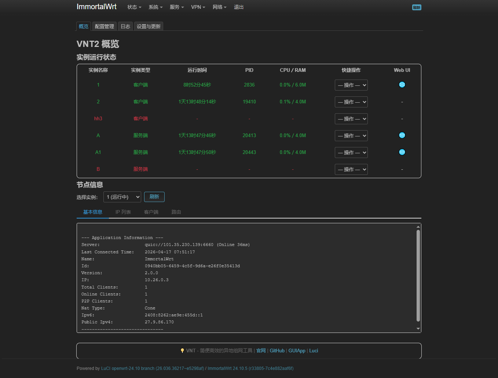
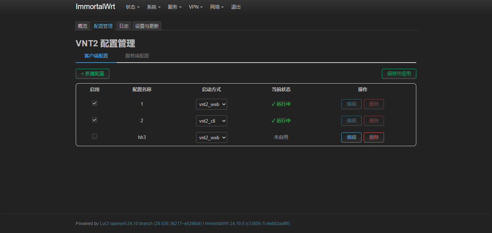
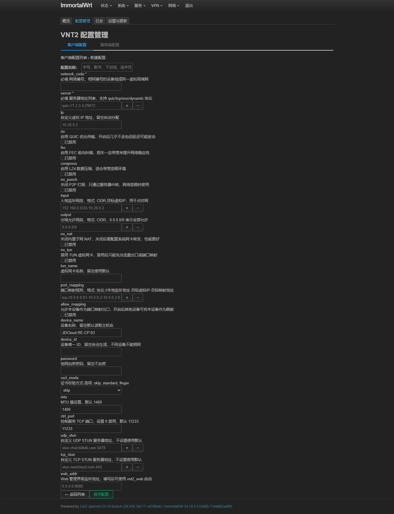
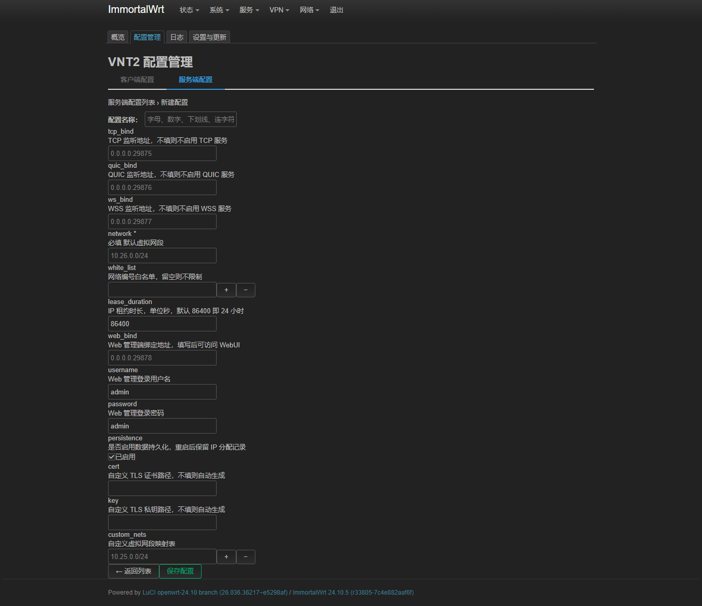
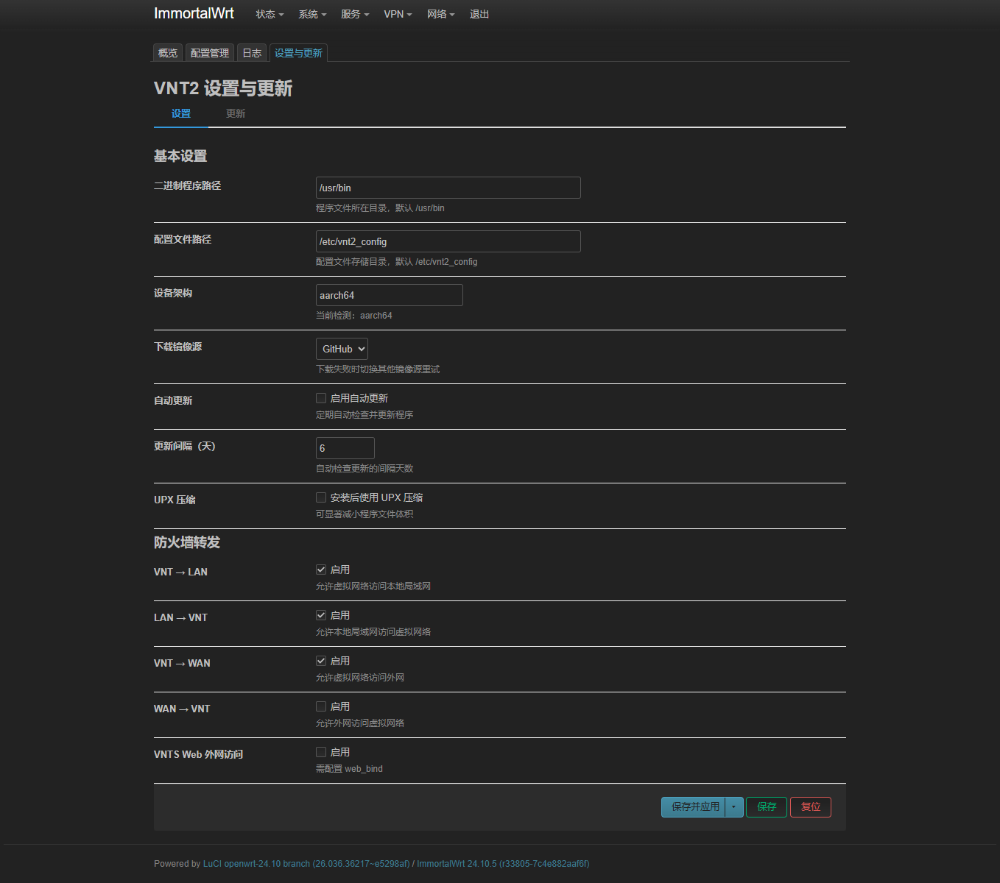
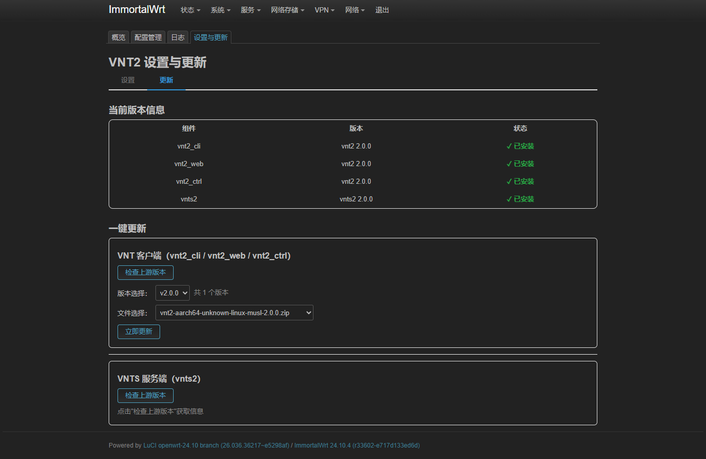
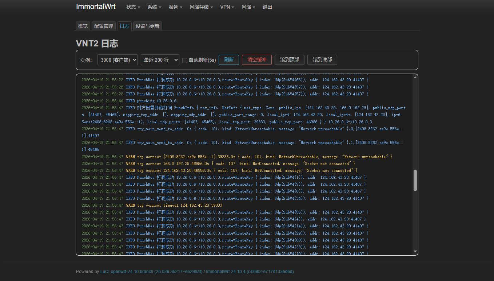
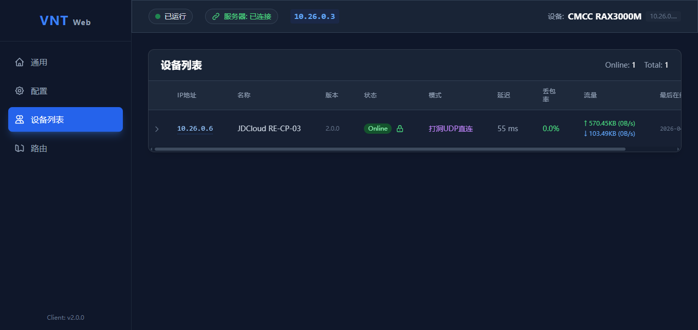

# LuCI - VNT2 组网管理界面

>luci-app-vnt2 一个为 OpenWrt LuCI 设计的 VNT 虚拟组网管理前端，支持多实例并发、实时监控、一键更新与防火墙自动放行。



## ✨ 主要功能

### 🔥 多实例运行
支持同时运行多个 VNT 客户端和服务器实例，每个实例独立配置、独立启停，轻松接入多个虚拟网络或同时提供多个服务端。



### 📊 状态仪表盘
实时查看各实例运行状态、CPU/内存占用、运行时长、版本信息。

### ⚙️ 客户端配置
图形化编辑客户端参数：Token、IP、MTU、端口映射、STUN 服务器等。



### 🖥️ 服务端配置
配置服务端监听端口、虚拟子网、白名单、WebUI 账号密码等。



### 🌐 全局设置
选择更新镜像源（GitHub / GitLab / Gitee）、自动更新策略、UPX 压缩等。



### 📦 在线更新
一键检查并下载最新二进制文件，自动安装并重启服务。



### 📜 日志查看
实时查看各实例的运行日志，支持清空操作。



### 📜 vnt2 web界面
可实时查看状态，创建配置等

### 🔒 防火墙自动配置
为每个实例自动放行所需端口，创建独立防火墙区域，无需手动干预。

### 🚀 快速使用

1. 登录 OpenWrt → **VPN** → **VNT**
2. 创建多个配置文件（客户端/服务端），分别设置启用
3. 每个实例独立启动，互不影响


### 📥 安装说明
## 终端执行以下命令下载安装
```bash
  curl -fsSL "https://gitlab.com/whzhni/tailscale/-/raw/main/Auto_Install_Script.sh" | sh -s luci-app-vnt2
  ```
  ## 或
  ```bash
  wget -q -O - "https://gitlab.com/whzhni/tailscale/-/raw/main/Auto_Install_Script.sh" | sh -s luci-app-vnt2
  ```
[VNT VNTS 设置教程](Image/README.md)
